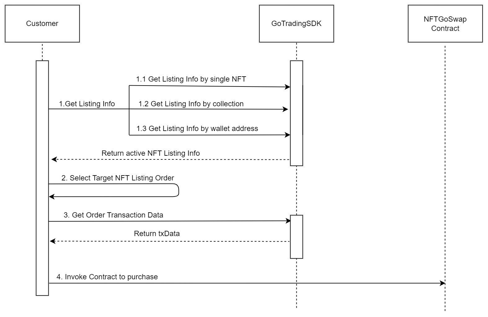
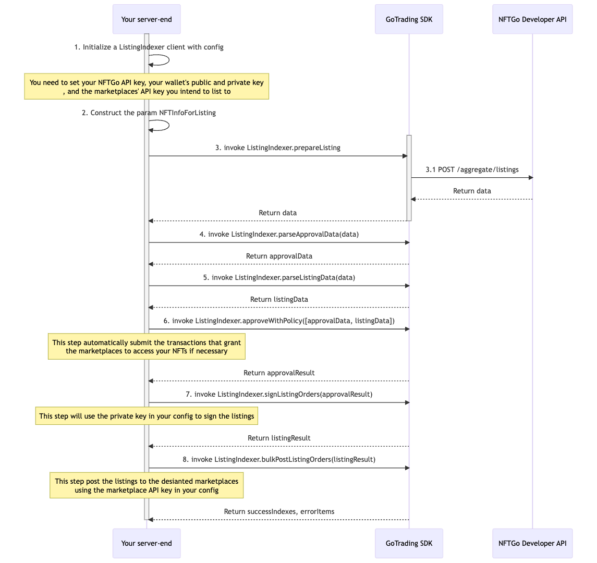
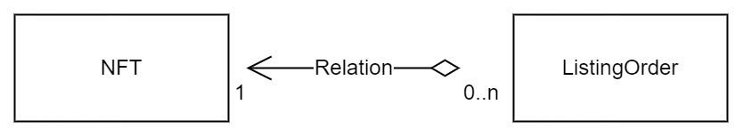

# GoTrading-js
[](https://nodejs.org/en/) [![Discord][discord-image]][discord-url] [![Twitter][twitter-image]][twitter-url]


## Introduction

<!-- Introduction -->

GoTrading is an open-source development kit that enables you to build your own NFT trading aggregator and marketplace. The SDK provides a comprehensive set of tools and APIs that greatly simplify the development process of a general trading aggregator like Gem.xyz or Blur.io, and allows developers to access real-time order feed and NFT transaction data. With the SDK, you can easily aggregate orders and functionality from mainstream marketplaces such as Opensea, Looksrare, Blur, x2y2, Sudoswap, etc, all in your products and communities.

## Key Features
 - Simple and easy-to-use API
 - Real-time market data access
 - Code is easy to customize and extend
 - Supports Blur NFT Exchange order purchases
 - Supports Bulk Listing and Bulk Buying

## Supported Marketplaces
GoTrading currently aggregates the following marketplaces, and we will continue to add more marketplaces in the future.

| **Marketplace** | **Bulk Listing** | **Bulk Buying** | **Protocol**     |
|-------------|--------------|-------------|--------------|
| OpenSea     | Yes          | Yes         | seaport-v1.5 |
|     Blur        |  Comming Soon   | Yes         | blur         | 
| LooksRare   | Comming Soon | Comming Soon         | looksrare-v2 |
| X2Y2        | Yes           | Yes        | x2y2         |


## Supported Chains
GoTrading currently supports the following chains: 
- Ethereum Mainnet
- Polygon Mainnet ( Comming Soon )


## Requirements
- Node.js >= 16.14
- web3 >= 1.8.2
- ethers >= 5.6.9, < 6.1

You can do this by running the following commands:
```bash
npm install web3 ethers@5.6.9
```

## Quickstart
### 1. Install the SDK.

> With `npm` :
```bash
npm install @nftgo/gotrading
```

> With `yarn` :
```bash
yarn add @nftgo/gotrading
```

### 2. Import and init the SDK.
- For server-side initialization:
```ts
import { init } from '@nftgo/gotrading';
import Web3 from 'web3';

// Create a new Web3 Provider to interact with the Ethereum network.
const provider = new Web3.providers.HttpProvider('https://mainnet.infura.io') //Replace with your own provider

// Configure the necessary parameters for the Trade Aggregator API client.
const configs = {
  apiKey: "YOUR-API-KEY", // Replace with your own API Key.
  web3Provider: provider,
  walletConfig: {
    address: "Your wallet address",
    privateKey: "Your private key"
  }, // Replace with your wallet info.
};

// Create a Trade Aggregator client instance and return the utility and aggregator objects of the Trade Aggregator API.
const {aggregator, utils} = init(configs);
```
- For client-side initialization:
```ts
import { init } from '@nftgo/gotrading';
import Web3 from 'web3';

// Configure the necessary parameters for the Trade Aggregator API client.
const configs = {
  apiKey: 'YOUR-API-KEY', // Replace with your own API Key.
};

// Create a Trade Aggregator client instance and return the utility and aggregator objects of the Trade Aggregator API.
const {aggregator, utils} = init(configs);
```
> ***Get your own NFTGo DEVELOPERS API Key***
>

> If you need to obtain an API key or a custom plan, please contact our support team. You can reach us by submitting a [form](https://forms.monday.com/forms/7fd30cd3cef08cf3b3dbccd1c72892b5), and we will respond to you within 1-2 business days.
>
> Please note that we may need to understand your use case and requirements in order to provide you with the API key and custom plan that best suits your needs. Thank you for your interest in our service, and we look forward to working with you.
###  3. Bulk Buy NFTs
```ts
import { NFTInfoForTrade } from '@nftgo/gotrading';

// List the NFTs you want to buy.
// We recommend using the aggregator.getListingOfNFT method to check whether your NFTs have valid listings.

// Note: If a Blur order is detected, an additional signature login will be performed to support Blur order purchases.
// The signature login process could take 5-15 seconds or even more.

const nfts: NFTInfoForTrade[] = [ // Replace with your own list of NFTs.
  {
    contract: "0xcfff4c8c0df0e2431977eba7df3d3de857f4b76e",
    tokenId: "16",
    amount: 1 // How many you want to buy. Usually used in ERC1155 nfts
  },
  {
    contract: "0xcfff4c8c0dF0E2431977EbA7dF3D3De857f4B76e",
    tokenId: "18",
    amount: 1
  }
];

// Configure the necessary parameters for bulk buying NFTs.
const bulkBuyConfig = {
  ignoreUnListedNFTs: false, // Do you want to ignore unlisted NFTs?
  ignoreInvalidOrders: false, // Do you want to ignore invalid orders?
  ignoreSuspiciousNFTs: false, // Do you want to ignore suspicious NFTs?
  withSafeMode: false, // Use Safe Mode or Without Safe Mode.
};

// Buy the NFTs specified in the nfts array using the Trade Aggregator API.
aggregator.bulkBuy({
  nfts,
  onSendingTransaction: (hash: string) => console.log(hash), // Callback function when a transaction is being sent.
  onFinishTransaction: ( // Callback function when a transaction is finished.
    successNFTs: NFTBaseInfo[],
    failNFTs: NFTBaseInfo[],
    nftsListingInfo: NftsListingInfo
  ) => console.log(successNFTs, failNFTs, nftsListingInfo),
  onError: (error: Error, nftsListingInfo?: NftsListingInfo) =>
    console.log(error, nftsListingInfo), // Callback function when an error occurs during the bulk buy process.
  config: bulkBuyConfig,
});
```

## GoTrading Purchase Process

### Step1 Get listing info
  - ***1.1 Get the listing info of a single nft.***

```ts
// Retrieve the listing information for BAYC #1
const baycContract = "0xBC4CA0EdA7647A8aB7C2061c2E118A18a936f13D";
const tokenId = "1";

const listingData = await aggregator.getListingsOfNFT(baycContract, tokenId);
if (listingData?.listingOrders.length > 0) {
  console.log(listingData.listingOrders[0].orderId as string); // Output the order ID of the first listing in the array.
}
```

  - ***1.2 Get listing info of the Collection.***
```ts
// Bored Ape Yacht Club contract address.
const baycContract = "0xBC4CA0EdA7647A8aB7C2061c2E118A18a936f13D";

const { nfts } = await aggregator.getListingsOfCollection(baycContract);

// Loop through each NFT and log the order ID of its listing.
for (const nft of nfts) {
  console.log(nft.listingData?.listingOrders[0].orderId)
}
```

  - ***1.3 Get the listing info of a Wallet address.***
```ts
// rollbot wallet address.
const walletAddress = "0x8ae57a027c63fca8070d1bf38622321de8004c67";
const { nfts: walletNFTList } = await aggregator.getListingsOfWallet(walletAddress);

// Iterate over each NFT in the wallet's listings and log the order ID of the first listing.
for (const nft of walletNFTList) {
    console.log(nft.listingData?.listingOrders[0].orderId)
}
```
### Step2 Select desired NFT listing order
```ts
//eg: get all listing NFT order ids of a wallet address.
const orderIds: string[] = [];
for (const nft of walletNFTList) {
  orderIds.push(nft.listingData?.listingOrders[0].orderId as string);
}
```

### Step3 Retrieve transaction data for purchasing
```ts
import { AggregateParams } from '@nftgo/gotrading';
const orderIds = ["orderIds"]; // Replace with Step2 OrderIds.

const params: AggregateParams = ({
  buyerAddress: 'buyerAddress', // Replace with buyer address. Must be the same with your wallet address
  isSafe: false,
  orderIds: orderIds,
});

const aggregateResponse = await aggregator.getAggregateInfo(params);

console.log(aggregateResponse);
```

### Step4 Invoke Contract to purchase
```ts
import { BigNumber } from 'ethers';
utils?.sendTransaction({
  from: aggregateResponse.txInfo.fromAddress,
  to: aggregateResponse.txInfo.toAddress,
  data: aggregateResponse.txInfo.data,
  value: BigNumber.from(aggregateResponse.txInfo.value.toString()).toHexString()
}).on('transactionHash', (hash)=>{
  console.log(hash);
}).on('receipt', (receipt)=>{
  if (receipt.logs.length) {
    for (const log of receipt.logs) {
      // not every log with useful info
      const decodedLog = utils.decodeLog(log);
    }
  }else {
    console.log('transaction fail for some unknown reason')
  }
}).on('error', (error)=>{
  console.log('transaction fail: ', error);
});
```
## GoTrading Bulk Listing Process (For Server-end)


## ***complete example***
- For server-side:
```ts
// init sdk client
import Web3 from 'web3';
import { initListingIndexer, NFTInfoForListing } from '@nftgo/gotrading';

// server
const provider = new Web3.providers.HttpProvider('https://cloudflare-eth.com/');

const openseaApi = {
  apiKey: 'apiKey', // replace with your own api key
  requestsPerInterval: 2,
  interval: 1000,
};
//Replace with your own provider
const config = {
  apiKey: 'api key', // Replace with your own API Key.
  web3Provider: provider, // Replace with your provider,
  walletConfig: {
    address: 'Your wallet address',
    privateKey: 'Your private key',
  }, // Replace with your wallet info.
  openSeaApiKeyConfig: openseaApi,
  //   looksRareApiKeyConfig: looksrareApi,
  //   x2y2ApiKeyConfig: x2y2Api,
};
// create Indexer client
const { listingIndexer } = initListingIndexer(config);

// Get the listing info of BAYC No.1
const baycContract = '0xBC4CA0EdA7647A8aB7C2061c2E118A18a936f13D';
const maker = '0x0000' ?? this.config.walletConfig?.address

const listingNFTS: NFTInfoForListing[] = [
  {
    contract: baycContract,
    tokenId: '1',
    ethPrice: 60,
    marketplace: 'OpenSea',
  },
  {
    contract: baycContract,
    tokenId: '2',
    ethPrice: 60,
    marketplace: 'OpenSea',
  },
  {
    contract: baycContract,
    tokenId: '2',
    ethPrice: 60,
    marketplace: 'LooksRare',
  },
];

  const bulkListing = () => {
    /**
     * Step 1: Prepare listing:
     * This function takes two parameters: a list of NFTs to be listed and the owner's address.
     * The prepareListing function returns the specific parameter details required for the subsequent steps of the process
     * such as the parameters needed for signing and posting.
     */
    const data = await listingIndexer.prepareListing(listingNFTS, maker);
    /**
     * Then, do some simple data formatting and prepare to hand it over to the next process.
     */
    const approvalData = listingIndexer.parseApprovalData(data);
    const listingData = listingIndexer.parseListingData(data);
     /**
     * Step 2: Approve Listing Item with Policy:
     * This function will authorize the approvedItems and return the final set of ListingItems.
     * Note that NFTs must be authorized before being listed, and only one authorization is required per collection per address.
     */
    const approvalResult = await listingIndexer.approveWithPolicy([approvalData, listingData]);
    /**
     * Step 3: Sign Listing Item:
     * This function takes in an array of ListingItem objects that need to be listed.
     * The user will sign these items using their configured private key, typically stored in their wallet on the client-side.
     * Once signed, the function returns an array containing two elements:
        SignedListingItem[]: the successfully signed ListingItems.
        ErrorListingItem[]: any ListingItems that failed to be signed.
    */
    const [listingResult, errorOrders] = await listingIndexer.signListingOrders(approvalResult);
    /**
     * Step 4: Post Listing Item:
     * This function will post the listing order to the target marketplace.
     * It takes as input the SignedListingItem that was previously signed in the previous step.
     * This is the final step of the listing process, where a request is made to the market API.
     * The function will return information about the final result of the listing.
     */
    const [successIndexes, errorItems] = await listingIndexer.bulkPostListingOrders(listingResult);
    const errorIndexes = [...errorOrders, ...errorItems];
  }

```

## Model Diagram


## Complete example
  - [***BuyByCollectionListings***](https://github.com/NFTGo/GoTrading/blob/master/docs/tradeAggregator/BuyByCollectionListings.md)

  - [***BuyByNFTListings***](https://github.com/NFTGo/GoTrading/blob/master/docs/tradeAggregator/BuyByNFTListings.md)

  - [***BuyByWalletListings***](https://github.com/NFTGo/GoTrading/blob/master/docs/tradeAggregator/BuyByWalletListings.md)

  - [***BulkBuy***](https://github.com/NFTGo/GoTrading/blob/master/docs/tradeAggregator/BulkBuy.md)

  - [***BulkList***](https://github.com/NFTGo/GoTrading/blob/master/docs/tradeAggregator/BulkList.md)


## Interface example
  - [***SingleAddressListingsResponse***](https://github.com/NFTGo/GoTrading/blob/master/docs/interfaces/SingleAddressListingsResponse.md)
  - [***SingleNFTListingsResponse***](https://github.com/NFTGo/GoTrading/blob/master/docs/interfaces/SingleNftListingResponse.md)
  - [***CollectionListingsParam***](https://github.com/NFTGo/GoTrading/blob/master/docs/interfaces/CollectionListingsParam.md)
  - [***CollectionListingResponse***](https://github.com/NFTGo/GoTrading/blob/master/docs/interfaces/CollectionListingResponse.md)
  - [***AggregateParams***](https://github.com/NFTGo/GoTrading/blob/master/docs/interfaces/TradeAggregatorParams.md)
  - [***AggregateResponse***](https://github.com/NFTGo/GoTrading/blob/master/docs/interfaces/TradeAggregatorResponse.md)


## Questions & Feedback

> If you have any questions, issues, or feedback, please file an issue on GitHub, or drop us a message on our [Discord][discord-url] channel for the SDK.

##  License

This project is licensed under the [BSD-3-Clause license](LICENSE).


[discord-image]: https://img.shields.io/discord/1040195071401787413?color=brightgreen&label=Discord&logo=discord&logoColor=blue
[discord-url]:  https://discord.gg/nftgo
[twitter-image]: https://img.shields.io/twitter/follow/NFTGo?label=NFTGo&style=social
[twitter-url]:  https://twitter.com/NFTGoDevs
